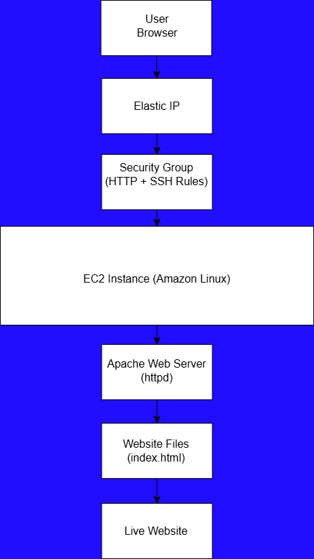

# Project 02 - EC2 Web Server Hosting

## Overview
This project demonstrates how to launch and configure an AWS EC2 instance to host a custom HTML website using Apache.

The goal of this project was to gain hands-on experience with:
- Amazon EC2
- Linux terminal commands
- Apache web server installation
- Security Groups
- SSH connections
- Website hosting
- Basic HTML/CSS deployment

---

## Architecture Diagram



---

## AWS Services Used
- EC2
- Security Groups
- Elastic IP / Public IPv4
- Amazon Linux

---

## Features
- Hosted custom HTML website
- Styled landing page
- Responsive navigation bar
- Custom color scheme
- Live public web server

---

## Skills Practiced
- Launching EC2 instances
- Connecting through PowerShell/SSH
- Navigating Linux directories
- Installing Apache (`httpd`)
- Editing website files
- Managing permissions
- Restarting services
- Documentation and screenshots

---

## Website Directory
```bash
/var/www/html
```

---

## Main Commands Used

### Install Apache
```bash
sudo yum install httpd -y
```

### Start Apache
```bash
sudo systemctl start httpd
```

### Enable Apache
```bash
sudo systemctl enable httpd
```

### Check Apache Status
```bash
sudo systemctl status httpd
```

---

## Lessons Learned
- How EC2 instances function as cloud servers
- How security groups control traffic
- How Apache serves website files
- Importance of documentation and organization
- Real-world troubleshooting using Linux terminal

---

## Author
John Fenton
Future Cloud Engineer | Coach | Builder